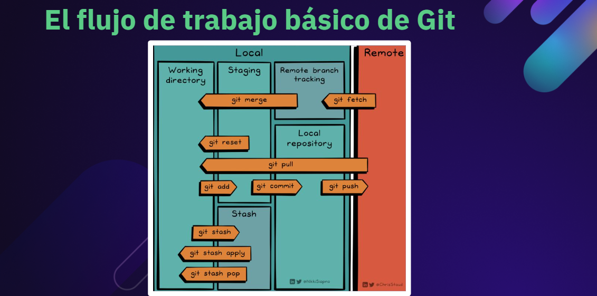
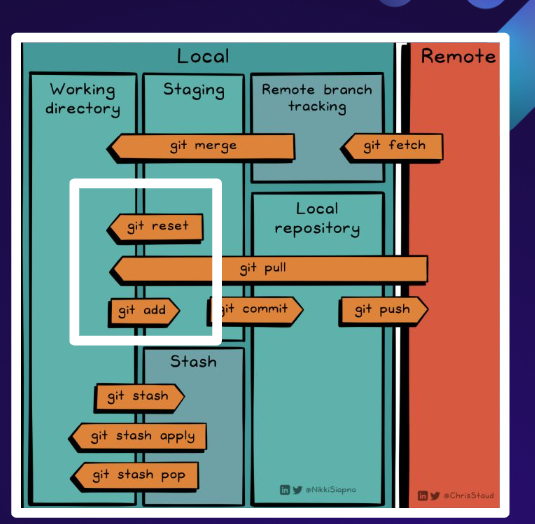
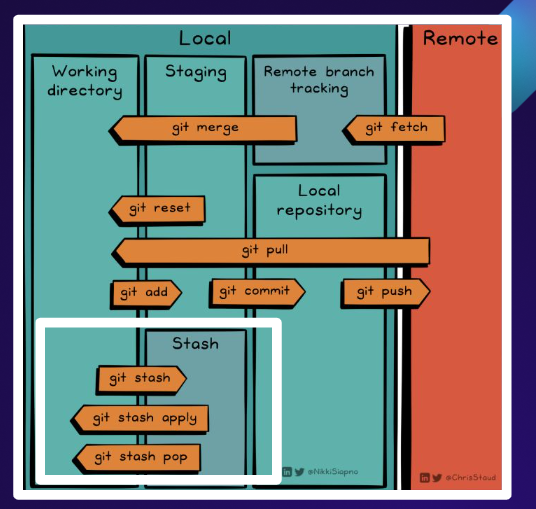
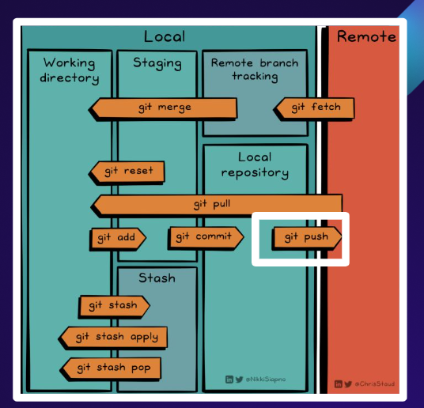

# 📌 Flujo de trabajo básico en GitHub



---

## 🔹 1. Working Directory
El **directorio de trabajo** se refiere al directorio local de nuestra computadora donde se almacenan los archivos del proyecto y donde actualmente realizamos cambios.

---

## 🔹 2. Área de Staging


Es un espacio intermedio donde se preparan y organizan cambios (código, datos y propiedades) antes de ser confirmados permanentemente en el repositorio.

---

## 🔹 3. Stash


`git stash` es un comando que permite **guardar temporalmente** los cambios en el directorio de trabajo, para poder trabajar en otra cosa y luego volver a aplicarlos más tarde.

---

## 🔹 4. Repositorio Local


Es una copia completa del historial y código base de un proyecto que reside en la máquina del desarrollador.  
Aquí se crean archivos, se realizan cambios y se confirman (commits).

---

# 📝 Ejercicios prácticos

## 🔸 Ejercicio 1: Flujo básico
1. Repasar comandos básicos.  
2. Crear una carpeta llamada **página**.
 ```sh
 mkdir pagina
 touch index.html
 ```
3. Dentro de la carpeta, crear un archivo llamado **index.html**.  
4. Agregar el siguiente código:

```html
<!DOCTYPE html>
<html lang="es">
  <head>
    <meta charset="UTF-8">
    <meta name="viewport" content="width=device-width, initial-scale=1.0">
    <title>¡Hola, Marines!</title>
  </head>
  <body>
    <h1>¡Bienvenid@! ¿Qué vas a aprender hoy?</h1>
  </body>
</html>
```
5. Crear un repositorio llamado CursoDeGithubGuardarAdministrarCambios.
```sh
1. En GitHub, haz clic en **New**`
2. Nombre: `CursoDeGithubGuardarAdministrarCambios`
3. Descripción: *Clase de Git*
4. Clic en ***Create repository***
5. Abrir la terminal en VSCode con :
  ```sh
    code .`sh
  ```
```sh
6. Iniciar Git.
```sh
git init
```
7. Agregar cambios, confirmar (commit) y hacer push.
```sh
git commit -m "mi primera pagina
git push -u origin main
```

8. Visualizar el archivo en html-preview

## Ejercicio 2: Área de Staging

1. Agregar un nuevo feature: menú de redes sociales.
```html
<h2>Redes sociales</h2>
<ul>
  <li><a href="https://facebook.com" target="_blank">Facebook</a></li>
  <li><a href="https://twitter.com" target="_blank">Twitter</a></li>
  <li><a href="https://linkedin.com" target="_blank">LinkedIn</a></li>
</ul>
```
2. Mover los cambios del área de trabajo al staging (git add).

3. Agregar un nuevo cambio: YouTube.
```html
<li><a href="https://www.youtube.com/" target="_blank">YouTube</a></li>
```
4. Regresar los cambios de staging al área de trabajo.

5. Volver a preparar (staging), confirmar y mover al repositorio local.

6. Hacer push al repositorio remoto.

7. Ver cambios en html-preview

## 🔸 Ejercicio 3: Stash

1. Crear una tabla de cursos:
```html
<table style="width:100%">
  <tr>
    <th>Cursos</th>
    <th>Clases</th>
    <th>Horas</th>
  </tr>
  <tr>
    <td>Python</td>
    <td>20 clases</td>
    <td>5 horas</td>
  </tr>
</table>
```

2. Guardar cambios en stash porque llegó un cambio urgente.

3. Modificar fondo y agregar imagen:
```html
<body style="background-color:powderblue;">
  
</body>

```
4. Mover a staging → repositorio local → remoto.

5. Recuperar stash y continuar la tabla:

```html
<tr>
  <td>PHP</td>
  <td>10 clases</td>
  <td>2 horas</td>
</tr>
```
6. Subir cambios al remoto.

7. Crear dos stash más:

```html
<h1 style="border:2px solid Tomato;">Hello World</h1>
<h1 style="background-color:#ff6347;">Este es un texto</h1>

```


